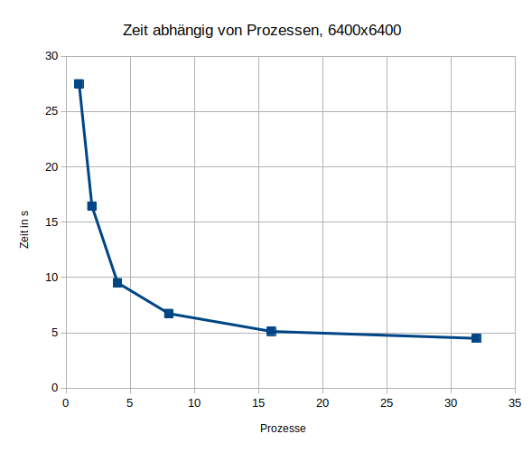

# Anleitung zur Prüfungsaufgabe

## Abhängigkeiten
Damit das Projekt lauffähig ist müssen folgende Abhängigkeiten installiert sein:  
- python3: `sudo apt install python3`
- mpirun: `sudo apt install mpich`

Damit MPI mit Python verwendet werden kann muss mpi4py installiert werden, dies geht so: 
- `python3 -m pip install -r requirements.txt` (traditionelle Art)
- `sudo apt install python3-mpi4py` (ab Ubuntu 23.04 nötig)

## Das Programm laufen lassen
Mithilfe folgenen Befehls kann das Programm ausgeführt werden: `mpirun -np NUMBER_PROCESSES python3 main.py ROWS COLUMNS`.  
Dabei müssen die groß geschriebenen Worte ersetzt werden durch:  
- `NUMBER_PROCESSES`: Anzahl der Prozesse, zB. 8
- `ROWS`: Anzahl der Zeilen der start-Matrix, zB. 1000
- `COLUMNS`: Anzahl der Spalten der start-Matrix. zB. 1000
- zusätzlich kann noch das flag `--print-matrix` gesetzt werden, dann wird die zufällig generierte Matrix ausgegeben
  - am besten nur bei kleinen Matritzen
  - am besten Ausgabe in file speichern

Beispiele: 
- `mpirun -np 8 python3 main.py 1000 1000`
- `mpirun -np 8 python3 main.py 12 12 --print-matrix`
- `mpirun -np 8 python3 main.py 30 30 --print-matrix > ergebnis.txt`

Benchmark laufen lassen: `time mpirun --use-hwthread-cpus -np 32 python3 benchmark.py > ergebnis.txt`
- lässt das Programm mit verschiedenen Matrixgrößen und Kernen laufen
- schreibt ergebnis in `ergebnis.txt`
- dauert bei mir ca. 9 Minuten

## Allgemeine Dokumentation

### Parallelisierungsansatz
Die Parallelisierung kommt durch die Aufteilung der Startmatrix in "Blöcke" aus Zeilen.
Die Startmatrix wird in n kleinere Matritzen aufgeteilt, n ist dabei die Anzahl der Prozesse.
Jede von den aufgeteilten Matritzen hat gleiche viele Spalten wie die Startmatrix.
Die Anzahl der Zeilen ist pro aufgeteilter Matrix ist `#Zeilen_Startmatrix/n + 1`.
Das Aufteilen der Startmatrix erfolgt wie in einem Binärbaum.
Die eine Extrazeile ist nötig damit die Ergebnisse später zusammengeführt werden können.
Nach dem Aufteilen der Matrix berechnet jeder Prozess in seiner eigenen kleinen Matrix die zusammenhängenden Teile.
Zum Schluss werden die Teilergebnisse wieder zusammengeführt.
Dies geschieht auch wieder wie in einem Binärbaum.

### Struktur des Programmes
In der [main.py](main.py)-Datei befindet sich die parallele Logik.
Der Prozess mit dem Rang 0 generiert die Startmatrix.
Danach wird die Aufteilung der Matritzen wie in einem Binärbaum durchgeführt.
Daraufhin berechnet jeder Prozess die zusammenhängenden Zellen in seiner Matrix.
Dafür führt jeder Prozess in seiner Matrix Tiefensuchen durch.
Wenn dies geschehen ist, werden die Teilergebnisse wieder zusammengeführt.
Dies geschieht über die merge-Funktion der "Row"-Klasse.
Das zusammenführen der Matritzen erfolgt wieder wie in einem Binärbaum.

Die Zufällige Matrix wird in [generator.py](generator.py) mittels eines random-walks erstellt.
Die Anzahl und Größe der Inseln ist zufällig, jedoch abhängig von der Größe der Matrix.
Es können maximal `sqrt(#zeilen * #spalten)` Inseln auftreten.
Die Größe der einzelnen Inseln ist ebenfalls durch `sqrt(#zeilen * #spalten)` beschränkt.

### Laufzeitanalyse
Die Aufwändigsten Teile des Programmes sind die Tiefensuche und das zusammenführen der Teilergebnisse.
Die Tiefensuche ist am aufwändigsten.
Diese ist quasi vollständig parallelisiert.
Das Zusammenführen der Teilergebnisse ist durch das Speichern der Inseln in Mengen und das Vorfiltern der zu zusammenführenden Mengen auch recht effektiv.
Zu Beginn, wenn noch recht wenig gemergt werden muss, sieht die Laufzeit recht linear in Abhängigkeit von den Prozessen aus.
Das das mergen jedoch noch besser optimiert werden müsste, dauert es bei umso mehr eingesetzen Prozessen länger (und muss auch öfter durchgeführt werden).
Da die Zeit zum mergen immer in etwa die gleiche bleibt konvergieren die Ergebnisse dann bei einer höheren Anzahl an Prozessen gegen einen festen Wert.
Zusätzlich ist zu beachten, dass sich die Laufzeit immer nur verbessert wenn ein neuer "2^x-Meilenstein" ereicht ist.
Dies ist der Fall, da wenn die Prozesse nicht genau aufgehen, andere Prozesse doppelt so viel rechnen müssen wie andere.
Dies könnte auch optimiert werden.
In den anhängenden Bildern sind die Benchmarks anhand von Beispielwerten visualisiert.

